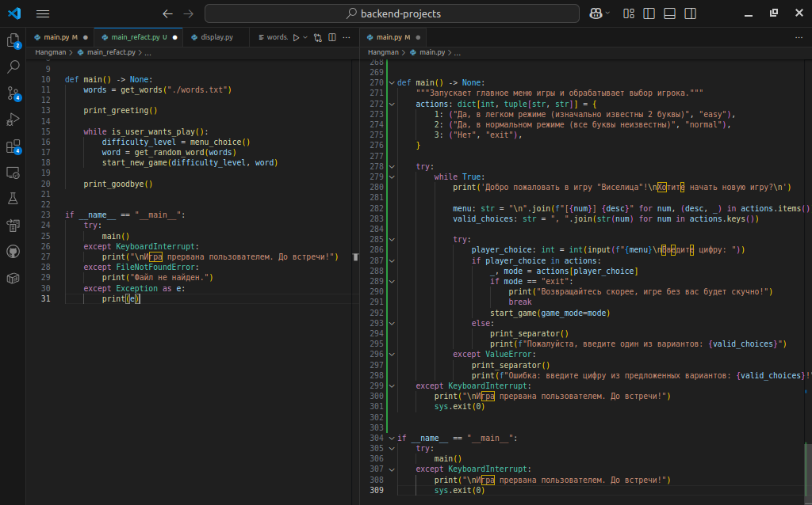

Работа программы
----------------

Программа работает согласно ТЗ, не вылетает, не крашится, соответствует как требования заказчика, так и ожиданиям конечного пользователя.

Единственное замечание/пожелание - вместо прокрутки вывода, сделать очистку экрана. В конечном файле review\_changes.py будет показано, как это сделать.

Логика программы и общее впечатление
------------------------------------

В целом, можно сказать что основная задача проекта роадмапы достигнута, процедурная декомпозиция программы реализована в достаточной мере, логика приложения понятна при беглом просмотре.

Из минусов - реализация логики некоторых функциий неочевидна и чтобы ее понять, нужно напрячься. В часности это касается функций: 

main, select\_letters\_for\_easy.

Что касается функции main, она у тебя переусложнена обработкой исключений и логикой игрового меню. Тут ты неможко не дожал декомпозицию, логику меню лучше вынести в отдельную функцию.

* * *

Вообще, желательно чтобы функции по типу main у тебя были короткими, но вместе с тем емкими и легкими и читались наподобии псевдокода в декаларативной манере. Например:

*   получить словарь

Цикл \[пока пользователь хочет играть\]

*   выбрать режим игры
*   выбрать случайное слово
*   запустить новую игру

Проверка ошибок

Отдельные замечания
-------------------

### Положительные

Хорошо постарался над валидацией пользовательского ввода, предусмотрел все возможности.

Функции короткие понятные и хорошо  задокументированы, также очень неплохо форматируешь код - приятно читать)

### Негативные

Не всегда понимаешь где и как нужно обрабатывать исключения и как вообще огранизовать логику их обработки. В частности, программа не должна резко обрываться и завершаться внутри какой-то функции, после того как ты отловил исключение. Просто дай этому исключению "всплыть" на верхний уровень, где ты сможешь его обработать исходя из контеста. 

Например у тебя программа может завершиться при ошибке открытия файла, но происходит это в стеке вызова функций main->start\_game->initialize\_game->get\_random\_word->open...

```python
    def initialize_game(game_mode: str = "normal") -> GameState:
        """
        Инициализирует состояние игры.
    
        :param game_mode: Режим игры, может быть "easy" или "normal". По умолчанию "normal".
        :return: Словарь с состоянием игры, содержащий загаданное слово, маску слова, счетчик ошибок, список угаданных букв,
        максимальное количество ошибок и режим игры.
        """
        word = get_random_word()
        if word is None:
            print("Не удалось загрузить слово для игры. Игра завершена.")
            sys.exit(1)
```

Здесь ты сначала перехватываешь файловые исключения внутри функции get\_random\_word, возвращаешь из нее значение None, а уже ориентируюсь по нему, завершаешь программу с выводом ошибки.

Лучше эту логику перенести в самую верхнуюю функцию, где ты сейчас перехватываешь исключение KeyboardInterrupt, либо в функцию main. Потому-что только их уровень понимания контекста может определять, заканчивается игра или нет, и если да, то каким образом.

На такой небольшой программе не очевидно преимущество такой структуры, но где-то начиная с третьего проекта, ты сможешь оценить все ее прелести)

***

Также что еще можно отнести к замечанию, что у тебя каждый раз заново открывается и читается целый файл, для того чтобы просто получить одно случайное слово.

```python
    def get_random_word() -> str | None:
        """
        Выбирает случайное слово из файла для игры.
    
        :return: Случайное слово или None, если не удалось загрузить слово.
        """
        try:
            with open("Hangman/words.txt", encoding="utf-8") as file:
                words: list[str] = file.read().splitlines()
                if not words:
                    print("Файл пустой.")
                    return None
                return choice(words)
        except FileNotFoundError:
            print("Файл не найден.")
            return None
        except Exception as e:
            print(f"Ошибка при чтении файла: {e}.")
            return None
```

В данном случае это не критично, но лучше неизменяемые данные считывать и сохранять только один раз.

Что касается функции main и логике в ней, сделаю примерный набросок того, как я ее вижу.



Еще бы я изменил логику функции select_letters_for_easy, как я понял, ты в ней выбираешь какие буквы будут открыты, и это будут либо уникальные буквы или повторяющиеся.

```python
def select_letters_for_easy(word: str) -> list[str]:
    """
    Выбирает буквы для раскрытия в легком режиме.

    :param word: Загаданное слово.
    :return: Список букв, которые будут раскрыты.
    """
    letter_counts: dict[str, int] = get_letter_counts(word)
    double_occurrence_letters: list[str] = [char for char, count in letter_counts.items() if count == EASY_MODE_LETTERS]
    single_occurrence_letters: list[str] = [char for char, count in letter_counts.items() if count == 1]

    if len(single_occurrence_letters) >= EASY_MODE_LETTERS:
        return sample(single_occurrence_letters, EASY_MODE_LETTERS)
    elif double_occurrence_letters:
        return [choice(double_occurrence_letters)]
    else:
        return []
```
Насколько я понял, то пока у тебя кол-во уникальных букв >= EASY_MODE_LETTERS, то будут открываться разные буквы. Но если подумать, то это будет происходить в подавляющем большинстве случаев, поэтому не совсем понятно, зачем нужна еще одна ветка с double_occurence_letters. Ее логика будет задействована только когда в слове длиной больше EASY_MODE_LETTERS будет больше повторяющихся букв, чем уникальных. Так навскидку, мне сложно подобрать такие слова)

И еще совет насчет фукции get_letter_counts. Ее логика полностью повторяет то, что ты можешь получить с помощью структуры данных Counter. В большинстве случаев лучше использовать базовые, встроенные в язык структуры и алгоритмы. Так ты будешь и меньше кода писать, и он будет понятнее другим разработчикам. Это некритично, но просто мысль на будущее.

В целом, ты большой молодец, учитывая что это твой первый проект и начал изучать программирование ты недавно.
Так держать!


