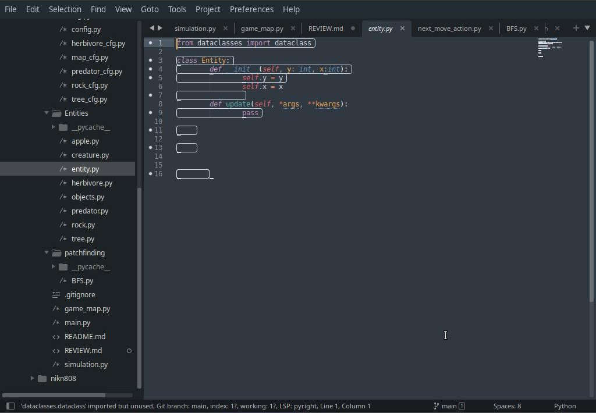
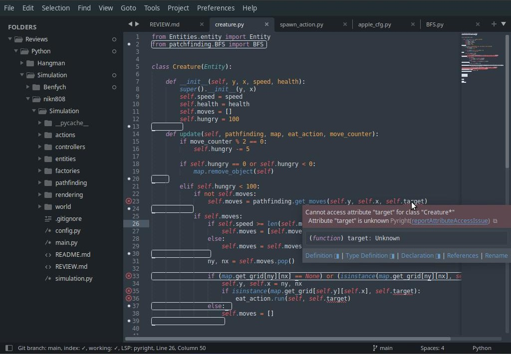
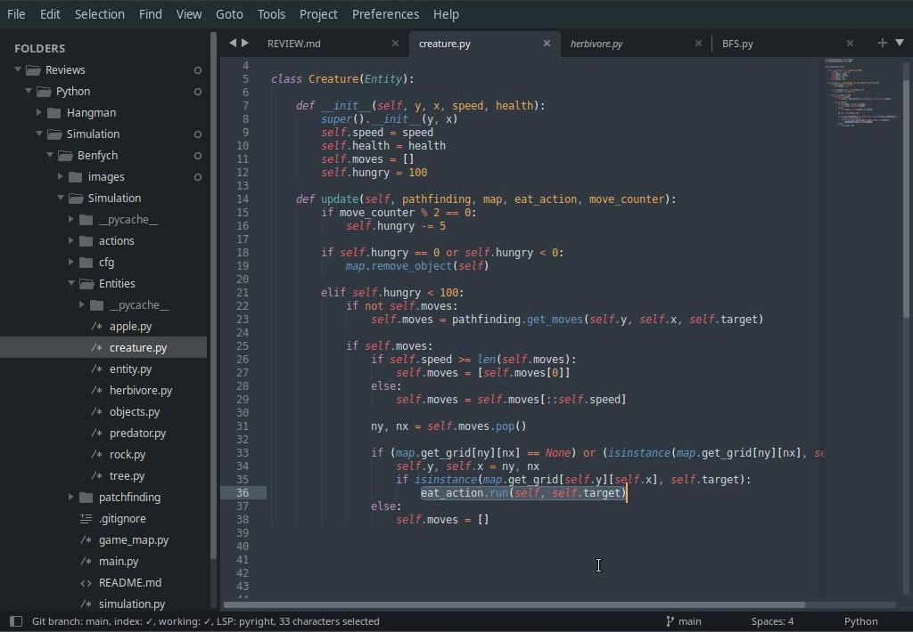
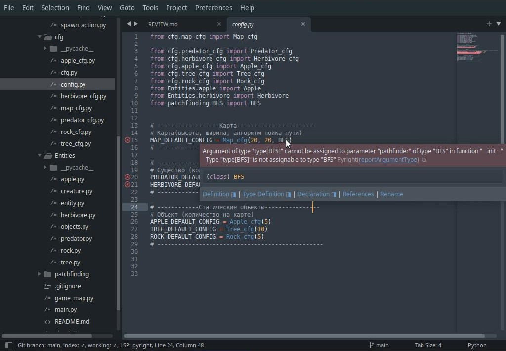
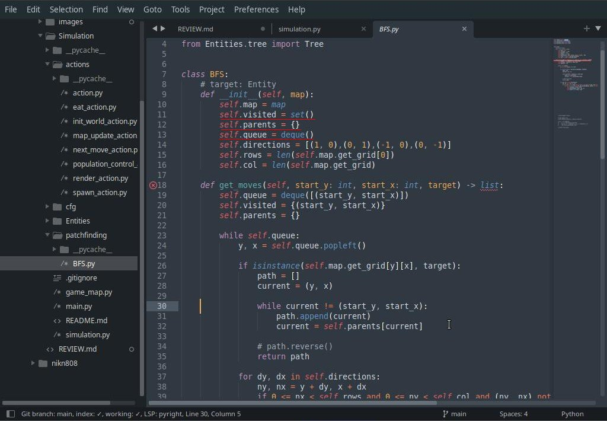
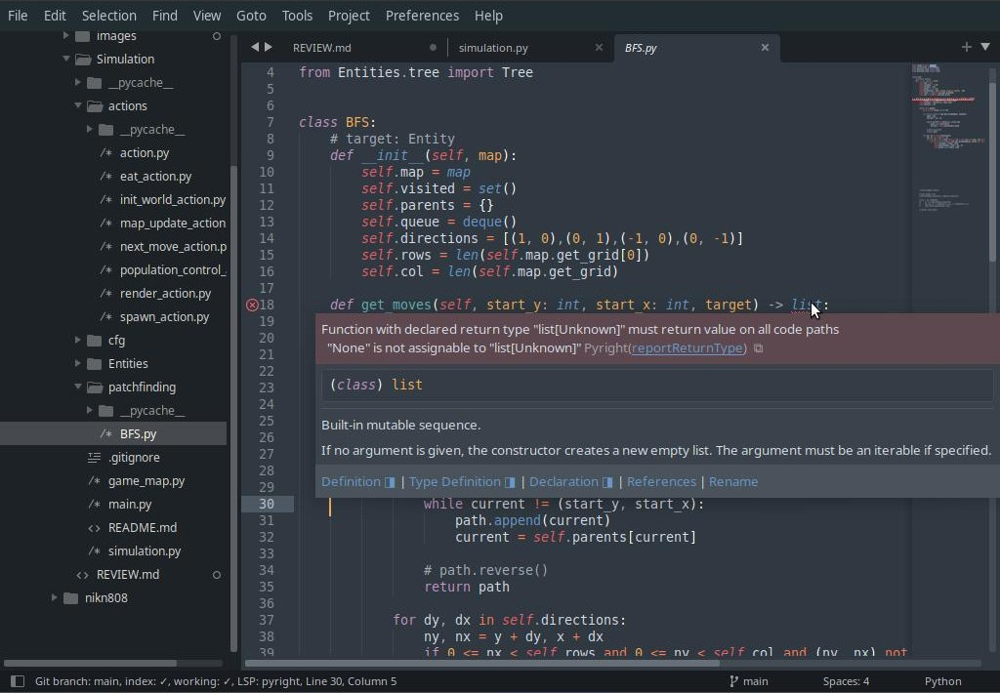

# Читаемость

Установи какой-то форматер кода, типа Black, Anaconda или подобных. Смотря что тебе больше подходит по используемой IDE. У тебя во многих местах лишние пробелы там где должны быть просто пустые строки и много лишних строк в конце файла. Это не критически, но влияет на читаемость кода. У меня все проблемные места в редакторе подсвечиваются и это отвлекает.



# Структура

Вся структура проекта четко разнесена по директориям и сразу понятно где что находится. Лично я бы перенес pathfinding в папку типа utils, но это дело вкуса.

Еще бы я советовал сразу писать проект в установленном стиле.
В частности, это требует помещение всего кода проекта в директорию src, чтобы по итогу получилось что-то вроде:

```text
./Simulation
├── /src
│   ├── /actions
│   ├── /cfg
│   ├── /Entities
│   ├── /factories
│   ├── /patchfinding
│   ├── /game_map
│   └── simulation.py 
├── /tests
├── main.py
├── .gitignore
└── README.md
```

Если ты решишь сделать это потом, то у тебя могут "поломаться" некоторые импорты, зависящие от структуры.

Хорошо что есть файл .gitignore и отдельно файлы для конфигураций. Хотя к самому содержимому директории cfg у меня вопросы, но я их освещу в секции [Код](#Код), с конкретными пояснениями.

Еще заметил что ты не всегда соблюдаешь конвенции Python, в частности по именованиям.
Имена директорий/модулей должны быть с маленькой буквы и snake_case, имена классов с большой и CamelCase.

Например пакет Entities должен называться entities, а класс Eat_action - EatAction. 

❗️- Я указываю это только здесь и не буду в каждом подходящем файле упоминать о том, что нужно изменить название.
Также я не буду в каждом классе повторяться о необходимости сокрытия переменных, которые не используются нигде кроме класса.

# Работа программы

Программа полностью реализует функционал прописанный в ТЗ.
Пару замечаний по пользовательскому опыту:

1. Я уже описывал тот баг, когда у тебя одну клетку "занимают" несколько сущностей и отрисовывается только одна. Они то пропадают, то появляются. Это сбивает с толку.
   В секции [Код](#Код) я попробую разобрать с чем это связано или намекну тебе в какую сторону копать.

2. Ты писал программу под ___Windows___, а все что касается обращения к консоли, априори следует считать не портабельным. Тут имеется в виду очистка экрана.
   У меня выводится следующее сообщение:
   
   ```text
   sh: 1: cls: not found
   ```
   
   и связано это с тем, что в ___Linux___ очистка консоли делается командой "clear".
   Или предупреждай в REAME.md заранее что программа расчитана на работу только в определенной ОС или постарайся добиться кроссплатформенности.

	В частности для функции очистки экрана это сделать очень просто, погугли, там всего одна строка кода.

3. Для выхода из программы у тебя нужно вызвать прерывание клавиатуры:
   
   ```text
   Выход: ctrl + c
   ```
   
   но когда это делаешь, то программа заканчивается выбрасыванием исключеня с распечаткой всего traceback.

	Это плохо, значит ты в коде программу не завершаешь, а просто "разрешаешь" ей завершиться. Нужно перехватывать это исключение на одном из верхних уровней и распечатывать информацию о завершении игры. Ну или не распечатывать, как тебе захочется)

❗️- Вообще заглядывая наперед, я заметил что у тебя мало где делается проверка ошибок и перехват возмжных исключений.

# Код

## Entities

### Entities/Entity.py

1. Импортируешь dataclass но не используешь.

```python
from dataclasses import dataclass

class Entity:
        def __init__(self, y: int, x:int):
                self.y = y
                self.x = x

        def update(self, *args, **kwargs):
                pass
```

2. Отступы в 8 пробелов, хотя в других файла по 4 пробела. Установи форматер, я писал об этом подробнее в секции [Читаемость](#Читаемость).

3. Решил хранить координаты в сущности, это не запрещается и принципе норм решение.
   Но у тебя есть возможность их поменять извне, а это может сломать логику всей программы. Вообще заметил что у тебя в большинстве классов практически все поля публичные. Ранее ты спрашивал про инкапсуляцию и как ее правильно организовать. Я советую изначально делать все поля приватными и недоступными из внешнего кода, до тех пор, пока они тебе явно где-то не понадобятся. Так ты будешь постепенно создавать интерфейс для взаимодействия с классом используя логику работы самой программы. Можно конечно и заранее все это спланировать, но это для новичка будет слишком сложно, да и не дает гарантии, что ничего не изменится.

4. Метод **update** вызывает у меня большие вопросы.
- Во-первых его сигнатура. Лучше не используй обобщенные параметры типа \*args, \*\*kwargs для методов объекта, это путает и непонятно что ему вообще передавать?
- Во-вторых, сама необходимость функциональности предоставляемой этим методом. Тут ты просто зачем-то заменил название прописанному в ТЗ методу **make_move** на **update**, по крайней мере его логика на это указывает, но используется он только для объектов типа **Creature**. 
Так какой в нем смысл для класса **Entity**? Советую просто перенсти его в другой класс.

❗️- Если ты его перенесешь как я советую, у тебя программа будет крашится в местах вызова экшенов(Next_move), там где ты получаешь объекты из карты и вызываешь метод **update**. 
Просто получай только подходящие объекты, например класса **Creature**.

Например так, но это в принципе можно сделать +100500 способами.

```python
for obj in self.objects:
    obj.update(self.pathfinding, self.map, self.eat_action, self.simulation.get_move_counter)

# =============================================================

is_creature = lambda obj: isinstance(obj, Creature)

for obj in filter(is_creature, self.objects):
    obj.update(self.pathfinding, self.map, self.eat_action, self.simulation.get_move_counter)
```

### Entities/objects.py

Тут ты зачем-то "аккумулируешь" импорты из других файлов, очевидно пытаясь создать логику пакета для импортов его содержимого.

```python
from Entities.apple import Apple
from Entities.predator import Predator
from Entities.rock import Rock
from Entities.tree import Tree
```

Это пишется в файле \_\_init\_\_.py

☝️ - Совет 

Посмотри те курсы, которые Сергей Жуков указал в описании проекта.
Например курсы Балакирева - Добрый, добрый Python.
Там подробно рассказывается об импортах, пакетах и как правильно их структурно организовать .

### Entities/ tree.py, rock.py, apple.py, herbivore.py, predator.py

Вызвает сомнение то что ты используешь "спрайтовое" представление объекта, через метод \_\_str\_\_.

- Во-первых, у тебя это становится сильно разнесено по коду, т.е. нужно будет заглянуть в каждый класс, чтобы увидеть все используемые "спрайты".
- Во-вторых, сильно привязывает тебя к данной конкретной реализации, т.е. консольному выводу. В проекте Симуляции, один из уроков который нужно для себя вынести, это как писать гибкую программу. Ну или по крайней мере, понимание, что в будущем может усложнить внесение изменений, без серьезного рефакторинга кода.

☝️ - Совет

Перенеси логику определения соответствия сущность -> спрайт в какое-то другое место. В файлы конфига или туда, где произодится "рендер".

Пример:

```python
SPRITES_EMOJI = {
    "Tree": "🌳",
    "Rock": "🗿",
    "Predator": "🐺",
}
```

### Entities/creature.py

- Creature.update(self, pathfinding, map, eat_action, move_counter):

Ну что сказать, тут все очень плохо.

1. Первое что бросается в глаза, что тут, почему-то, ты уже не используешь типизацию. Хотя в других файлах используешь, это странно. Старайся соблюдать один стиль во всем проекте, а то создается впечатление что его либо писали несколько человек, либо в разные временные промежутки.

2. Ты вызываешь внутри такой код:
   ```python
   self.moves = pathfinding.get_moves(self.y, self.x, self.target)
   ```
   но как видно из рисунка ниже, поле **target** у тебя отсутствует как в классе Creature, так и его предках.

	


	Я долго не мог понять как этот код вообще работает не вызывая исключений, пока еще раз на посмотрел на реализации других **Entities**.


   ```python
	class Herbivore(Creature):

    def __init__(self, y, x, speed, hp, target):
        super().__init__(y, x, speed, hp)
        self.target = target
   ```

	Т.е. у тебя в коде, в методе предка, вызывается поле объекта, которое появляется только в классе потомка... 🤯😳🫣

	Ты так смог сделать только потому, что в Python динамическое типизирование и любой компилируемый язык, дал бы тебе по рукам. Для выявления такого рода ошибок, используй сторонние плагины, поддерживаемые твоей IDE. Вообще странно что ты стараешься использовать типизацию в Питоне, но не используешь инструменты проверяющие эту типизацию. Как будто бы ты это делаешь исходя не из понимания необходимости, а из-за того, что кто-то так сказал делать. Просто для галочки. Хотя я могу и ошибаться.

	В общем, не делай так. Перенеси поле **target** в класс **Creature**.

3. Ты смешиваешь функциональность в методе **update**, реализуя в нем логику голодания.

	```python
	if move_counter % 2 == 0:
        self.hungry -= 5

	if self.hungry == 0 or self.hungry < 0:
        map.remove_object(self)

	elif self.hungry < 100:
        ...
	```
	
	Либо перенеси это в отдельный метод, либо в отдельный **Action**.

4. Не удаляй сущности из других сущностей, ты так усложнишь себе отладку.
	```python
	map.remove_object(self)
	```

	Лучше сделай какой-то маркер, что сущность "готова к удалению", например поле ___self.is_dead___ или что-то наподобие того.
А потом просто удаляй такие сущности в экшене RemoveDeadEntities или подобном.
Так ты перенесешь логику удаления в одно место и тебе будет проще отлавливать ошибки.

5. Ты используешь Action внутри метода сущности, это очень плохо.

	

	Т.е. ты скорее всего не понял, зачем вообще нужны эти разные Action, а также где и как их нужно вызывать. Ты должен обращаться к ним только из основного класса Simulation и больше НИГДЕ!

	Подумай как тебе следует реорганизовать взаимодействие сущностей, чтобы вынести Eat_action за пределы класса Creature.

☝️ - Совет

Посмотри какие-то ролики по устранению проблем излишней вложенности.
Например вот этот [Escape Nesting Hell - Do This Instead - YouTube](https://www.youtube.com/watch?v=rHRbBXWT3Kc)

Вот что я имею в виду на примере ниже

```python
elif self.hungry < 100:
    if not self.moves:
        self.moves = pathfinding.get_moves(self.y, self.x, self.target)

    if self.moves:
        if self.speed >= len(self.moves):
            self.moves = [self.moves[0]]
        else:
            self.moves = self.moves[::self.speed]

        ny, nx = self.moves.pop()

        if (map.get_grid[ny][nx] == None) or (isinstance(map.get_grid[ny][nx], self.target)):
            self.y, self.x = ny, nx
            if isinstance(map.get_grid[self.y][self.x], self.target):
                eat_action.run(self, self.target)
        else: 
            self.moves = []

# =======================================================================

if self.hungry >= 100:
    return

# тут я не понимаю, зачем ты используешь старый список ходов
# если в новой итерации мира, цель могла уже изменить свою позицию
# наверное лучше каждый раз искать путь заново    
if not self.moves:
    self.moves = pathfinding.get_moves(self.y, self.x, self.target)

if not self.moves:
    return

if self.speed >= len(self.moves):
    self.moves = [self.moves[0]]
else:
    self.moves = self.moves[::self.speed]

ny, nx = self.moves.pop()

# проверяй None только через оператор is
# a == None - неправильно
# a is None - правильно
# а вообще этот предикат можно переписать проще, учитывая что ты два раза получаешь сущность
# if isinstance(map.get_grid[ny][nx], (self.target, None)):
if (map.get_grid[ny][nx] == None) or (isinstance(map.get_grid[ny][nx], self.target)):
    self.y, self.x = ny, nx
    if isinstance(map.get_grid[self.y][self.x], self.target):
        eat_action.run(self, self.target)
else: 
    self.moves = []
```

## actions

### actions/action.py

У тебя метод **Action.run** объявлен без параметров, хотя как минимум там должен быть ___self___. Опять таки, поставить себе какую-то проверку кода для Python(линтер, форматер), и тебе все это сразу будет подсвечиваться.

Общие замечания касательно всех остальных классов наследников **Action**.

1. Названия классов не включают слово Action и при импорте вообще не понятно что это за сущность. 

	Пример кода из Simulaion:

	```python
	from actions.init_world_action import Init_world
	from actions.next_move_action import Next_move
	from actions.map_update_action import Map_update
	from actions.render_action import Render
	from actions.spawn_action import Spawner
	from actions.population_control_action import Population_control
	```

	Из вызывающего кода совсем не понятно что это за сущности. Гораздо лучше будет сделать так:
	```python
	from actions.init_world_action import InitWorldAction
	from actions.next_move_action import NextMoveAction
	from actions.map_update_action import MapUpdateAction
	from actions.render_action import RenderAction
	from actions.spawn_action import SpawnAction
	from actions.population_control_action import PopulationControlAction
	```
	
2. У тебя везде разные параметры для переопределяемого метода **Action.run**, так быть не должно. Они все должны следовать только одному четко оговоренному интерфейсу, иначе, я не понимаю как ты вообще их можешь вызывать в единообразном стиле... 🤯
   ```python
   # action.py
   def run():

   # eat_action.py
   def run(self, obj, target):

   # spawn_action.py
   def run(self, obj):

   # init_world_action.py
   # map_update_action.py
   # next_move_action.py
   # population_control_action.py
   # render_action.py
   def run(self):

   ```

### actions/eat_action.py

```python
from Entities import creature
```

Импорт не используется.

Все что у тебя происходит в классе **Eat_action** не соответствует тому, что ожидается от экшенов. В частности то, что этот экшен вызывается у тебя для определенного объекта. Я думаю лучше перенести эту логику в класс **Creature** и назвать метод **eat** или наподобии того.

Сам алгоритм "голодания" я особо не разбирал, верю что он работает)

Вот этот код очень напрягает:

```python
target_rm = [target
    for target in self.map.get_objects
    if isinstance(target, obj.target) and 
        obj.x == target.x and obj.y == target.y
]

if target_rm:
    target_rm = target_rm[0]
else:
    return
```

Ты зачем-то составляешь список сущностей, которые относятся к определенному классу и при этом все стоят одновременно на одной клетке поля.
Разве не странно, что у тебя вообще предполагается такая вероятность?
И в итоге ты потом берешь только одну из этих сущностей... 🙄

Я чисто для интереса написал выбрасывание эксепшена в коде, если у тебя этот список будет больше длины 1 и он сработал.

☝️ - Совет

Чтобы понять где у тебя находится проблемное место, попробуй просто бросать эксепшен в методе карты, когда пытаешь добавить сущность на занятую позицию.

### actions/map_update_action.py

Как я уже писал в чате, тебе этот класс вообще нужен только по тому, что у тебя происходит нарушение согласованности состояния карты. Он выполняет роль своеобразного костыля и только создает больше предпосылок для новых ошибок. Если сейчас у тебя в коде перепутать последовательность вызовов экшенов, то появятся баги, которые просто так не отследишь, а они одни из самых неприятных... 🤕

☝️ - Совет

Убери этот класс из проекта, а вместо него, просто организуй правильную логику добавления/удаления/перемещения для сущностей.

### actions/next_move_action.py

Импорт не используется

```python
from actions.map_update_action import Map_update
```

А этот используется, но зря...

```python
from actions.eat_action import Eat_action
```

Ты не должен использовать одни экшены внутри других, это путает логику программы и приходится вчитываться в код чтобы понимать что происходит и почему. 

Очень желательно, чтобы ты стремился к написанию такого кода, суть которого будет понятна при беглом просмотре, без необходимости внимательного вчитывания.

Имеется в виду сама структура программы. Понятно, что какие-то конкретные алгоритмы все-равно придется разбирать подробнее, но в твоем коде, часто приходится всматриваться кто там кого вызывает и почему. Это тратит много когнитивных ресурсов читающего. 🙏

☝️ - Совет

Подробнее почитай о паттерне **Комманда**.

В коде ниже, почти все плохо.

```python
def __init__(self, map: Map, simulation):
        self.map = map
        self.objects = self.map.get_objects
        self.pathfinding = self.map._pathfinding
        self.eat_action = Eat_action(self.map)
        self.simulation = simulation

    def run(self):
        self.simulation._move_counter += 1
        for obj in self.objects:
            obj.update(self.pathfinding, self.map, self.eat_action, self.simulation.get_move_counter)
```

Вот здесь у тебя по определению изменяемый список объектов, а ты получаешь его только единожды и работаешь потом только с ним.

```python
self.objects = self.map.get_objects
```

Подумай что будет, если ты изменишь реализацию класса **Map**?

☝️ - Совет

Запрашивай получение объектов у карты при каждом запуске метода **run**.

```python
def run(self):
    ...
    for obj in self.map.get_objects():
    ...
```

Насчет поиска пути, ты создаешь слишком длинную цепочку зависимостей, чтобы использовать его в итоге только внутри метода **update** класса **Creature**.

```python
# simulation.py/
# ./__init__
self.map = Map(
            MAP_DEFAULT_CONFIG.height,
            MAP_DEFAULT_CONFIG.width,
            MAP_DEFAULT_CONFIG.pathfinder
)

# next_move_action/
# ./__init__
self.pathfinding = self.map._pathfinding

# ./update
obj.update(self.pathfinding, self.map, self.eat_action, self.simulation.get_move_counter)

# Entities/creature/
# ./update
self.moves = pathfinding.get_moves(self.y, self.x, self.target)
```

Зачем, я не совсем понимаю, если как я уже говорил, используешь функциональность поиска пути ты ТОЛЬКО внутри класса **Creature**.

Добавь в код по созданию сущностей связку сущности с **pathfinding**, и тебе не нужна будет такая длинная цепочка пробрасывания его из класса в класс.

Старайся думать заранее, где конкретно тебе нужно использовать какой-то класс и связывай эти объекты как можно меньшим числом "посредников", а желательно просто напрямую, при инициализации.

```python
# Entities/creature/
# __init__
def __init__(self, y, x, speed, health, pathfinding):
    super().__init__(y, x)
    self.speed = speed
    self.health = health
    self.moves = []
    self.hungry = 100
    self.pathfinding = pathfinding
```

Ну или как-то наподобие того.

### actions/render_action.py

Опять таки, не понятно зачем ты реализовал Рендер как экшен.
В ТЗ пишется что это должен быть просто класс **Render**, который отвечает за отображение мира.

Вынеси его из модуля **actions** и реализуй просто как отдельный класс, объект которого ты будешь пробрасывать в симуляцию при создании.

Как-то так:

```python
game_map = GameMap(Width, Height)
render = Render(game_map)

simulation = Simulation(game_map, render)
```

### actions/population_control_action.py

Насколько я понял, это экшен который отвечает за поддерживание популяции сущностей в мире. Но как по мне, **Population_control** не лучшее название для класса с данной функциональностью. Я бы назвал его **RespawnEntitiesAction**, хотя тут скорее дело вкуса.

Гораздо важдее вопрос, почему он, следуя интерфейсу класса **Action**, при этом не наследуется от него?

```python
class Population_control:
```

Также не вижу особого смысле передавать в конструктор метода объект симуляции:

```python
def __init__(self, map, spawner, simulation):
        self.map = map
        self.spawner = spawner
        self.simulation = simulation
```

Потому-что используешь ты не его, а конфиги для создаваемых сущностей, которые зачем-то хранишь в симуляции, но используются они только внутри экшенов...

Еще более странно то, что сущность spawner, у тебя находится в директории **actions** и реализует их интерфейс **run**, хотя как и данный класс(Population_control), от него не наследуется. Да и вообще, **Spawner** не подходит под функциональность **Экшена**, а скорее является порождающей сущностью, т.е. **Фабрикой**.

```python
def run(self):
    for obj in self.simulation.spawn_config:
        if obj.count > self.map.get_population(obj.name):
            self.spawner.run(obj)  
```

☝️ - Совет

Передавай в методе конструктора сразу конфиги, а класс spawn_action/Spawner переквалифицируй в ___Фабрику сущностей___.

❗️- Вообще создается впечатление что ты не совсем понимаешь для чего тут нужно разделение на Action и зачем-то пытаешь совсем другие по функционалу сущности, привести к этому интерфейсу. Советую поизучать инфу по базовым паттернам проектирования. Ну хотя бы по тем, которые используются в проекте.

### actions/spawn_action.py

Кроме тех замечаний, которые я указал при разборе класса **Population_control**, могу дать совет по оптимизации кода в методе **run**:

```python
empty_cells = self.map.get_empty_cells()
shuffle(empty_cells)
y, x = empty_cells.pop()
```

Вместо двух последних строк, лучше используй следующий код:

```python
y, x = random.choice(emtpy_cells)
```

Он выбирает случайный элемент из коллекции и тебе не нужно заранее ее "перемешивать".

### actions/init_world_action.py

Те же самые замечания, что и для класса **Population_contorl**.
Непонятно из названия **Init_world**, что делает класс.

## /cfg

Я не буду подробно разбирать все классы конфигов, но отмечу только то, что они реализуют логику не конфигов, а фабрик для создания объектов с определенными параметрами. Из-за этого логика порождения новых сущностей настолько запутана, насколько это вообще возможно представить.

Я распишу инициализацию мира сущностью **Apple**

```python
# simulation/
# __init__(self)
self.init_actions = [Init_world(self.map, self, self.spawner)]

# ./init_simulation(self)
self.init_actions[0].run()

# actions/init_world_action/
# ./Init_world.run(self)
for config in self.simulation.spawn_config: # получаем apple_cfg
    for _ in range(config.count):
        self.spawner.run(config) # пробрасываем apple_cfg в spawner

# actions/spawn_action
# ./Spawner.run(self, obj)
cur_obj = obj.create_obj(y, x)

# cfg/apple_cfg
# ./Apple_cfg.create_obj(self, y, x)
return Apple(y, x)
```

Очень долго и утомительно было прыгать по классам чтобы составить представление о том, что и как происходит. Как минимум, в этой цепочки сущность **Spawner** у тебя лишняя, как на мой взгляд.

☝️ - Совет

Почитай про паттерн Фабрика.
Перенеси все конфиги с функцией порождения объекта из модуля **cfg** в другой модуль, например в **factories**.

### cfg/config.py

Здесь у тебя ошибки типизации.



У многих новичков, начинающих с Python отсутствует четкое разделение между типом, классом и объектом.

```python
# cfg/map_cfg.py
from patchfinding.BFS import BFS

@dataclass
class Map_cfg():
    height: int
    width: int
    pathfinder: BFS # здесь у тебя поле должны быть ОБЪЕКТОМ ТИПА BFS

# cfg/config.py
from patchfinding.BFS import BFS


# ------------------Карта-----------------------
# Карта(высота, ширина, алгоритм поика пути)
MAP_DEFAULT_CONFIG = Map_cfg(20, 20, BFS) # а тут ты передаешь сам КЛАСС BFS
```

☝️ - Совет

Лучше разберись с основами языка, в частности с типизацией.
Измени код на следующий:

```python
# cfg/map_cfg.py
from patchfinding.BFS import BFS

@dataclass
class Map_cfg():
    height: int
    width: int
    pathfinder: type[BFS] # здесь у тебя поле должны быть КЛАССОМ ТИПА BFS
```

Тоже самое касается и двух других конфигов: PREDATOR_DEFAULT_CONFIG, HERBIVORE_DEFAULT_CONFIG 

## /patchfinding

Неправильное название, четвертая буква лишняя. И ты тянешь эту опечатку во все классы, которые используют данный.

### pathcfinding/BFS.py

Если не знать самого проекта, то не очевидно что BFS вообще означает.
Назови как-то более понятнее, например PathFinderBFS.

❗️- Сам алгоритм поиска я не тестировал и глубоко в код не заглядывал.
Вроде бы поиск работает и видимых багов я не заметил.
Оставляю замечания только относительно написания кода.

Импорт не используется.

```python
from random import randint
```

Здесь не вижу смысла создавать эти переменные в виде полей объекта.



Создавай их просто в функции **BFS.get_moves**, без использования **self**.

Называя параметр функции **map** ты перезаписываешь встроенную в Python функцию **map**. Лучше так не делать.

Здесь семантическая ошибка:

```python
self.rows = len(self.map.get_grid[0])
self.col = len(self.map.get_grid) # лучше назови self.cols
```

Я заглянул в класс Карты, там такой код:

```python
self._grid = {i: [None] * self._width for i in range(self._height)}
```

И по логике этой инициализации, у тебя получается что ключи и их кол-во, зависит от высоты карты, а значит у тебя тут перепутана логика и правильно будет так:

```python
self.rows = len(self.map.get_grid)
self.cols = len(self.map.get_grid[0])
```

В любом случае, это ответственность карты и никакие внешние объекта, не должны зависить от ее устройства.

То же самое касается следующего кода:

```python
if 0 <= nx < self.rows and 0 <= ny < self.col and (ny, nx) not in self.visited:
if not isinstance(self.map.get_grid[ny][nx], Rock) and not isinstance(self.map.get_grid[ny][nx], Tree):
```

☝️ - Совет

Создай соответствующие метода в классе Карта.

- Map.is_valid(x, y)
- Map.is_free(x, y)
- Map.width
- Map.height

UDP: я заглянул в класс карты и вернулся сюда.
У тебя же там есть методы get_width и get_height, зачем тогда ты используешь информацию о внутреннем устройстве, я не понимаю... 🫠

Здесь ты указываешь в тайпинге, что возвращаешь список, но не возвращаешь его в конце функции, из-за чего возвращается значение None.



Вставь в конце возврат пустого списка, когда не удалось найти путь к цели.

## /.

### ./game_map.py

По большей части об этом классе я многое уже сказал, в контексте его использования другими объектами. Хотя есть и еще что добавить.

- Лучше переименуй класс, потому-что во-первых, его название не соответствует названию файла, во-вторых, оно слишком перекликается с названиями структуры данных __Map__ и функции __map__. Назови хотя бы **GameMap**.

- Вот эта строчка непонятно зачем:
	
	```python
	from cfg.herbivore_cfg import *
	```

- Зачем ты связываешь поиск пути с картой, пробрасывая его через инициализацию?

	```python
	def __init__(self, height: int, width: int, patchfinder):
	```

	Поиск пути должен быть связан с объектами, которые им пользуются.
В частности исходя из логики программы, всеми наследниками класса **Creature**. Да и вообще непонятно зачем ты это делаешь, если в итоге так и не используешь его внутри класса Карты.

- Кроме того, ты инициализируешь **patchfinder** самой картой, которая еще не до конца инициализирована...

	```python
	# ...
	self._pathfinding = patchfinder(self)
	#...
	```

	Так точно делать не стоит.

- ___Map.clear_cell()___

  Как по мне, это просто ненужный "костыльный" метод.
  То что он у тебя существует характерный признак того, что где-то ты неправильно используешь класс.

	Я бы еще поспорил с тем как ты хранишь сами сущности в карте, но это не так критично как все остальное. Хотя нужно сказать, что ты используешь тут словарь полностью дублируя структуру вложенного списка. Т.е. выгоды тебе от этого никакой, только лишний расход памяти. Подумай как использовать его более оптимально. Можешь посмотреть в чужих реализациях.

- ___Map.get_grid()___

  Как я уже говорил, считаю этот метод не столько лишним, сколько потенциально опасным. Потому-что ты возвращаешь из него изменяемое значение.

- ___Map.add_object()___ и ___Map.set_object()___

  Путает что есть два интерфейса добавления сущности, по крайней мере так кажется с первого взгляда. И что опять таки опасно, то что у тебя они не "синхронизированы".

	☝️ - Совет

	Сделай метод **set_object** приватным и вызывает его из **add_object** при добавлении сущности.

- ___Map.remove_object(self, obj)___

  Почему ты тут удаляешь объект из списка объектов, но оставляешь в словаре, непонятно...

	```python
	def remove_object(self, obj):
	    self._objects.remove(obj)
	    self._population[obj.__class__.__name__] -= 1
	```
	
	Возможно тут метод **clear_cell** выступает в роли парного, но это выглядит странно.

Что еще сбивает с толку, это именование property геттеров, с префиксом get_

```python
@property
def get_width(self) -> int:

@property
def get_height(self) -> int:

@property
def get_objects(self) -> list:

@property
def get_grid(self) -> dict:
```

Вместе с этим, у тебя есть и обычные методы такой же конвенцией именования.

```python
def get_empty_cells(self) -> list:

def get_population(self, object_name) -> int:
```

Проблема тут в том, что они вызываются по разному, одни как свойства(данные), другие как методы(поведение), и это сильно путает.

Само слово get_ как бы говорит, что ты хочешь что-то получить, т.е. даешь заявку на получение информации, а значит вызываешь какую-то функцию. Но это путает, когда ты используешь такое же именование для property, суть которого это избавление от конвенции вызова, чтобы обращение к методу выглядело как обращение к переменной.

Если звучит слишком запутанно, вот пример:

```python
width = map.get_width()
width = map.get_width
```

Какой из этих вызовов тебе интуитивно кажется более "правильным"?

☝️ - Совет

Не знаю просматривал ли ты курсы из советуемых в ТЗ, но крайне рекомендую посмотреть курсы Балакирева на ютубе или пройди их на Степике для закрепления. Когда я проходил, они были бесплатные.

Убери у всех property префикс get_.

### ./simulation.py

При инициализации ты не используешь ни одного параметра, а создаешь все внутри метода **\_\_init\_\_**. Это уменьшает гибкость твоей программы.

Ты очень сильно смешиваешь в этом классе разную функциональность из-за чего нарушаешь SRP - принцип единой ответственности. У тебя симуляция отвечает за интерфейс взаимодействия с пользователем, вывод на экран, очистку экрана, создание карты, сам процесс симуляции...

Предлагаю перенести все это наружу, оставив внутри класса только то, что отвечает за работу и логику самой Симуляции, а именно следующие методы: init_simulation, start_simulation, next_turn. Все остальное тут лишнее!

Я не хочу подробно расписывать как тебе это сделать, но это несложно и я думаю что ты справишься! 👍

Сделаю небольшой "рефакторинг", для примера того, что должно остаться.

```python
# Вместо этого кода
def next_turn(self):
    while True:

        print(
            "(1): 1 ход\n",
            "(2): выход",
            sep=""
        )
        choice = input("Выбор: ")

        if choice == "1":
            os.system('cls')
            self.turn_actions[1].run()
            self.turn_actions[0].run()
            self.turn_actions[2].run()
            self.turn_actions[3].run()


        if choice == "2":
            break

# ==============================================

# Должо остаться только это или нечто подобное
def next_turn(self):
    self.turn_actions[1].run()
    self.turn_actions[0].run()
    self.turn_actions[2].run()
    self.turn_actions[3].run()
```

Также что касается вызовов экшенов.
Сразу напрягает то что помещаешь ты их в список, но вызываешь не друг за другом, а каким-то "хитроумном" порядке... 🤯

В общем, там очень запутанная логика, первый раз читая код, вообще ничего не понятно.
Постарайся ее упростить и например, вынеси эти вызовы в отдельные методы.

Реализуй Рендер и перенеси в него логику отрисовки карты и очистки экрана.

# Общее впечатление

Хотя с натяжкой проект и можно назвать рабочим, но главная задача не достигнута. Очень плохо с декомпозицией и ООП. Код плохо отформатирован и в каждом файле используется разная стилистика.

Где-то используется типизирование, где-то нет.

Попробуй сделать все те изменения, которые я тебе посоветовал и параллельно посмотреть какие-то курсы по ООП и паттернам проектирования.

Крайне советую серьезно подойти именно к этому проекту, потому что на мой взгляд он краеугольный и на тех навыках и знаниях, которые ты вынесешь с него, будет строиться твое дальнейшее обучение и развитие.

Я уверен что все получится, желаю удачи! 👍


